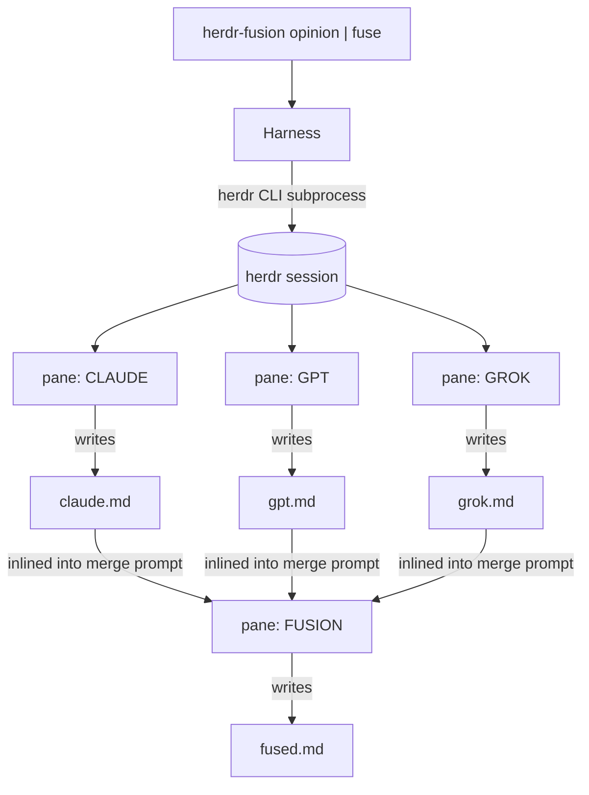

# Design notes — herdr-fusion

A case study in orchestrating **interactive** coding-agent TUIs — the kind you normally
drive by hand — into an unattended multi-agent pipeline, without an API key or a line of
glue that isn't standard-library Python.

## The problem

[fusion-harness](https://github.com/disler/fusion-harness) has a great idea: send one prompt
to several models, let them answer independently, then have a fresh agent critically merge the
answers into one. But it does it by spawning `pi --mode json -p` subprocesses billed per token.

I wanted the same fan-out-then-converge shape running on the **subscription CLIs I already pay
for** — Claude Code on my Claude plan, GPT through `pi` on the native `openai-codex` provider
(other models drop in via config) — so a run costs nothing marginal. Those tools are interactive
TUIs, not batch subprocesses. That
one constraint is the whole engineering problem.

## The core tension

An interactive agent TUI is built for a human at a keyboard: it shows a live pane, waits at
permission prompts, pops first-run trust dialogs, and never emits a machine-readable "I'm done."
To run N of them unattended and know when each has finished, I needed to solve three things the
batch model gets for free:

1. **Launch** an interactive TUI in a pane and detect when it's *ready for input* vs. *stuck on a
   startup dialog nobody will answer*.
2. **Submit** a prompt as if typed, without tripping multi-line paste quirks across different TUIs.
3. **Detect completion** with no exit code and no "done" event — across agents that may or may not
   expose their state.

[herdr](https://herdr.dev) supplies the substrate: it manages terminal panes and, for CLIs with
its integration installed, reports an agent's live status (`idle` / `running` / `blocked` /
`done`). herdr-fusion is the layer that turns that substrate into a reliable pipeline.

## Architecture

Every interaction with herdr goes through one function — `herdr(session, *args)` — which shells
out to the `herdr` CLI and parses JSON back. **IDs are always parsed from responses, never
constructed.** A `deep_get` walks nested JSON for a key so the code doesn't couple to herdr's exact
response envelope, which is the kind of thing that shifts between versions. That single choke point
is why the whole harness is ~400 lines: there's exactly one integration surface to reason about.

## Three decisions worth calling out

**Completion gating — the hard part.** A worker is "done" when: its answer file exists **and** has
stopped growing **and** the agent reports `idle`/`done`. File-stability alone is racy (an agent
pauses mid-write); status alone is unavailable when the integration isn't installed. Combining them
degrades gracefully — `unknown` status falls back to pure file-stability with a stricter stability
count. See `await_answer` in [`harness.py`](src/herdr_fusion/harness.py).

**Fail fast on the one thing a human must do.** First-run TUIs block on trust/login dialogs. Rather
than hang for the full launch timeout, `launch` watches for three consecutive `blocked` polls and
raises immediately with the **pane's on-screen contents** in the error — so the failure tells you
exactly which dialog to answer instead of timing out silently.

**Prompts are data, not code.** The worker / merge / opinion instructions are plain `.md` files with
`{{VAR}}` interpolation ([`prompts/`](src/herdr_fusion/prompts/)). Behavior changes are text edits,
and the 2-way upstream templates generalized to N-way by making the peer list and answer sections
loops rather than hardcoded pairs.

## What I'd do next

- **Readiness polling instead of `time.sleep(1.5)`** after pane splits — there's a deliberate
  `ponytail:` marker in the code noting the shell needs a beat before keystrokes land; a process-info
  poll is the honest fix.
- **Parallel await.** Workers launch concurrently but are awaited sequentially; wall-clock is fine
  because they overlap, but a single select-style wait would report completions in the order they
  actually finish.
- **Structured divergence report.** `fused.md` carries inline attribution today; a machine-readable
  consensus/divergence sidecar would make runs diffable.
- **Port the `/auto-validate` gate loop** from upstream (deliberately out of scope for v1).

## Constraints I kept honest about

It is **not** universal in the strong sense: it hard-depends on herdr being installed and running,
and on each worker CLI being logged in. Packaging (`uvx`, `uv tool install`) changes the install
friction, not that dependency. The completion heuristic is exactly that — a heuristic — and the code
says so where it matters.
